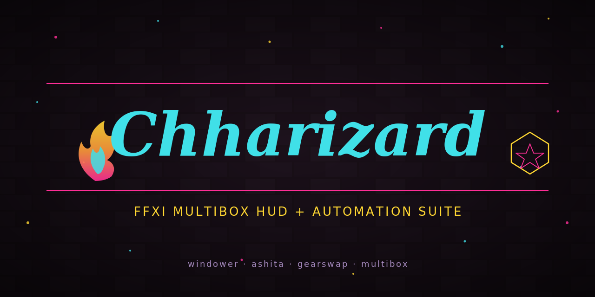

<p align="center">
  
</p>

<h1 align="center">Chharizard</h1>

<p align="center">
  <strong>FFXI multibox HUD, automation, and gearswap builder — all in one companion</strong>
</p>

<p align="center">
  <a href="https://github.com/ChharithOeun/Chharizard/stargazers"></a>
  <a href="https://github.com/ChharithOeun/Chharizard/blob/main/LICENSE"></a>
  <a href="https://www.lua.org/"></a>
  <a href="https://www.autohotkey.com/"></a>
  <a href="https://www.windower.net/"></a>
  <a href="https://www.ashitaxi.com/"></a>
  <a href="https://github.com/ChharithOeun/Chharizard/commits/main"></a>
</p>

<br />

<p align="center">
  <em>Run six-plus characters like one. Chharizard bundles a modular HUD, Mog Garden automation, camera control, and a gearswap builder into a single companion app — auto-updated from GitHub, configured with checkboxes, driven by a Lua addon suite that plugs into <strong>both Windower 4 (retail)</strong> and <strong>Ashita v4 (private servers)</strong>.</em>
</p>

---

> **⚠️ CONTACT POLICY**
>
> Please **do NOT contact me in-game** about this project. In-game tells about bugs, feature requests, or general Chharizard questions will be ignored.
>
> - **Bugs & issues:** [GitHub Issues](https://github.com/ChharithOeun/Chharizard/issues)
> - **Feature ideas:** [GitHub Discussions](https://github.com/ChharithOeun/Chharizard/discussions)
> - **Everything else:** open an issue, not a tell
>
> This keeps my in-game time for playing and keeps support in one auditable place for everyone.

---

## Why Chharizard?

FFXI multiboxers today juggle a dozen half-broken addons written by a dozen different people who all vanished in 2014. Rosters live in hardcoded arrays. Gearswap requires you to hand-write Lua. Turning a module on and off means editing `init.txt` in Notepad. And nothing works consistently across Windower and Ashita. Chharizard unifies all of it: a single Windows companion drives a curated addon suite, toggles features per-character with a GUI, generates gearswap files without you touching code, and pulls updates from GitHub on launch. One-time setup, then it just works — on retail *or* your private server of choice.

---

## Feature Highlights

**Modular HUD Suite (Chharbar)** — Vitals, party list, target info, DPS scoreboard, cast bar, hate meter, skillchain / magic burst predictor, per-toon tabbed chat, and enemy debuff tracking. Toggle each module per-character.

**Mog Garden Automation (Chharsai)** — State-machine driven daily runs. Harvest all four nodes, plant / harvest furrows, pet monster rearing, auto-sell to the Green Thumb Moogle. Bonsai-style state chains, tuned for multibox.

**Camera Control (Chharcam)** — Free the camera. Increase distance, adjust pan speed, save per-character preferences. Lua + native DLL for memory-poke performance.

**Gearswap Builder (Chhargear)** — Design gearswap files with a GUI. Pick items from the item database, wire up sets and rules, preview generated Lua, save to `gearswap/data/`. No more copy-pasting Motenten templates.

**Companion App (Chharizard.exe)** — Single-window AutoHotkey v2 app. Modules matrix, roster manager, character launcher, live log tail, embedded FFXI system tuner, one-click auto-updater.

**Cross-Framework** — Works on Windower 4 and Ashita v4 through a thin compatibility layer. The companion auto-detects your framework and installs the correct adapter.

**GitHub Auto-Update** — Chharizard polls the Releases API on launch. New version? One click downloads, verifies, extracts, and restarts.

**Privacy-First** — Rosters, per-character configs, and gearswap files stay on your machine. The repo ships with empty defaults. Your character names never hit GitHub.

---

## Framework Support

| Framework       | Client     | Status     | Notes                                          |
|-----------------|------------|------------|------------------------------------------------|
| **Windower 4**  | Retail     | ✅ Primary | Original development target                    |
| **Ashita v4**   | Private    | 🔄 Planned | Compat layer in v5.3.x                         |

Every module goes through `core/framework.lua` — an abstract API with two adapters (`compat_windower.lua`, `compat_ashita.lua`). Chharizard.exe detects your install and drops the correct one. Modules stay framework-agnostic.

---

## Components

| Component      | Type       | What it does                                                              |
|----------------|------------|---------------------------------------------------------------------------|
| **Chharizard** | .exe       | Companion GUI: modules, roster, launcher, auto-update, tuner, gearswap    |
| **Chharbar**   | Lua addon  | HUD suite — party, vitals, target, debuffs, cast bar, hate, WSC, chat     |
| **Chharsai**   | Lua addon  | Mog Garden automation — harvest, furrows, monster rearing, auto-sell      |
| **Chharcam**   | Lua + DLL  | Camera distance and pan speed control                                     |
| **Chhargear**  | Lua bridge | Gearswap file generator — exposes item/spell DB to Chharizard.exe         |

---

## Quick Start

### Prerequisites

- Windows 10 or 11 (x64)
- [Windower 4](https://www.windower.net/) *or* [Ashita v4](https://www.ashitaxi.com/) installed
- FFXI client (retail or private server)

### Installation

```bat
:: Download the latest release
curl -LO https://github.com/ChharithOeun/Chharizard/releases/latest/download/Chharizard.zip

:: Extract anywhere; run Chharizard.exe. It auto-detects your framework
:: and installs the enabled addons into the correct folder.
```

Or clone the repo directly:

```bat
git clone https://github.com/ChharithOeun/Chharizard.git
cd Chharizard
```

### First Launch

1. Run `Chharizard.exe`
2. Point it at your Windower or Ashita install directory when prompted
3. Add your characters in the **Roster** tab
4. Enable modules per-character in the **Modules** tab
5. Click **Launch** on any character — the framework opens with that profile

---

## In-Game Commands

Chharbar exposes `//cb` (Windower) or `/cb` (Ashita):

```
//cb                       -- show help
//cb showall               -- force all HUDs visible
//cb hideall               -- hide all HUDs
//cb resetpos              -- reset HUD positions to defaults
//cb save                  -- save current layout for this character
//cb perf on|off|report    -- performance profiler
//cb chat r "message"      -- reply to last incoming /tell
//cb debuffed              -- toggle debuff widget
//cb wsc                   -- toggle skillchain predictor
//cb hate                  -- toggle aggro meter
```

Chharsai (`//bon`), Chharcam (`//cam`), Chhargear (`//gear`) — full list in [`docs/COMMANDS.md`](docs/COMMANDS.md).

---

## Roadmap

- [x] **v5.0.0** — Rebrand Chharbar → Chharizard umbrella, monorepo scaffold
- [ ] **v5.0.x** — Split Chharbar.lua into `addons/Chharbar/modules/*.lua`
- [ ] **v5.1.0** — `Chharizard.exe` skeleton (Modules / Roster / Launcher / Tune / Update tabs)
- [ ] **v5.2.0** — Auto-updater backed by GitHub Releases API
- [ ] **v5.3.0** — Ashita v4 compatibility layer (`core/compat_ashita.lua`)
- [ ] **v5.4.0** — Chharsai — port Bonsai state-machine for multibox routines
- [ ] **v5.5.0** — Chharcam — port XICamera DLL, wrap in Chharizard commands
- [ ] **v5.6.0** — Chhargear — full gearswap builder GUI
- [ ] **v5.7.0** — In-game overlay for module toggles (no alt-tab required)
- [ ] **v5.8.0** — Shared party state broadcasting via named pipes for real multi-instance sync

---

## Credits

Chharizard stands on the shoulders of giants. Every addon or pattern that inspired a component is credited both here and in the corresponding source file's header. **If your work is used and you're not listed, open an issue and I'll fix it immediately.**

### Direct inspirations

| Project                                                          | Author        | Where it lives in Chharizard                                    |
|------------------------------------------------------------------|---------------|-----------------------------------------------------------------|
| [Bonsai](https://github.com/Noirblanc/Bonsai)                    | Noirblanc     | State-machine automation pattern used in Chharsai               |
| [XICamera](https://github.com/Hokuten/XICamera)                  | Hokuten       | Lua + native DLL pattern used in Chharcam                       |
| [XivParty](https://github.com/Tylas11/XivParty)                  | Tylas11       | Party list packet parsing (0xDD / 0xDF / 0xC8 / 0x076)          |
| [Skillchains](https://github.com/Ivaar/Skillchains)              | Ivaar         | WSC data tables (`assets/skills.lua`) used in Chharbar WSC      |
| [Debuffed](https://github.com/Xathe/Debuffed)                    | Xathe         | Status effect message-ID tables and parsing in Chharbar debuffs |
| [Battlemod](https://github.com/Windower/Lua)                     | Various       | Chat text-added event handling patterns in Chharchat            |
| [Chatmon](https://github.com/Windower/Lua)                       | Various       | Filtered chat routing patterns in Chharchat                     |
| [Motenten Gearswap templates](https://github.com/Motenten)       | Motenten      | Gearswap ruleset conventions used in Chhargear                  |

### Framework and platform

- [**Windower 4**](https://www.windower.net/) — the retail FFXI addon platform this project targets
- [**Ashita v4**](https://www.ashitaxi.com/) — the private-server FFXI addon platform this project targets
- [**AutoHotkey v2**](https://www.autohotkey.com/) — Chharizard.exe is written in AutoHotkey v2

### License-compatible reuse

Where code is directly derived (not just inspired), the source file carries the original author's license alongside the MIT header. Nothing is silently vendored.

**Beef policy:** none wanted. If you're an author whose work appears here and you'd prefer different attribution, removal, or a specific credit format, open an issue or email `chharizard@users.noreply.github.com` and I'll adjust immediately. Small community, please let's keep it that way.

---

## Configuration

Chharizard reads and writes JSON configs; the Lua addons hot-reload on change.

```jsonc
// addons/Chharbar/data/roster.json  (gitignored, local only)
{
  "characters": ["MainChar", "AltChar1", "AltChar2"],
  "main_tank":  "MainChar",
  "off_tank":   "AltChar1",
  "healers":    ["AltChar2"]
}
```

---

## Contributing

FFXI's community is small and the modding scene is smaller. If you play, you can help.

1. **Fork** the repository
2. **Create** your feature branch (`git checkout -b feature/amazing-thing`)
3. **Commit** your changes (`git commit -m 'Add amazing thing'`)
4. **Push** to the branch (`git push origin feature/amazing-thing`)
5. **Open** a Pull Request

Bug reports and feature ideas are equally welcome — [open an issue](https://github.com/ChharithOeun/Chharizard/issues/new). **Do not send tells in-game.**

---

## Community & Support

<p align="center">
  <a href="https://github.com/ChharithOeun/Chharizard/discussions"></a>
  <a href="https://github.com/ChharithOeun/Chharizard/issues"></a>
  <a href="https://github.com/ChharithOeun/Chharizard/releases"></a>
</p>

---

## Support Chharizard

<p align="center">
  <a href="https://github.com/sponsors/ChharithOeun"></a>
  <a href="https://buymeacoffee.com/chharbot"></a>
</p>

Chharizard is free and open source. A GitHub star costs nothing and helps other Vana'dielians find it.

---

## License

Distributed under the **MIT License**. See [`LICENSE`](LICENSE) for more information.

*FFXI, PlayOnline, and related trademarks are property of Square Enix. Chharizard is not affiliated with Square Enix, Windower, or Ashita. Use is subject to Square Enix's Terms of Service.*

---

<p align="center">
  <sub>Built by <a href="https://github.com/ChharithOeun">@Chharbot</a> — because six characters shouldn't need six pairs of hands.</sub>
</p>

<p align="center">
  <sub><strong>Reminder: do NOT contact me in-game. Use <a href="https://github.com/ChharithOeun/Chharizard/issues">GitHub Issues</a>.</strong></sub>
</p>
